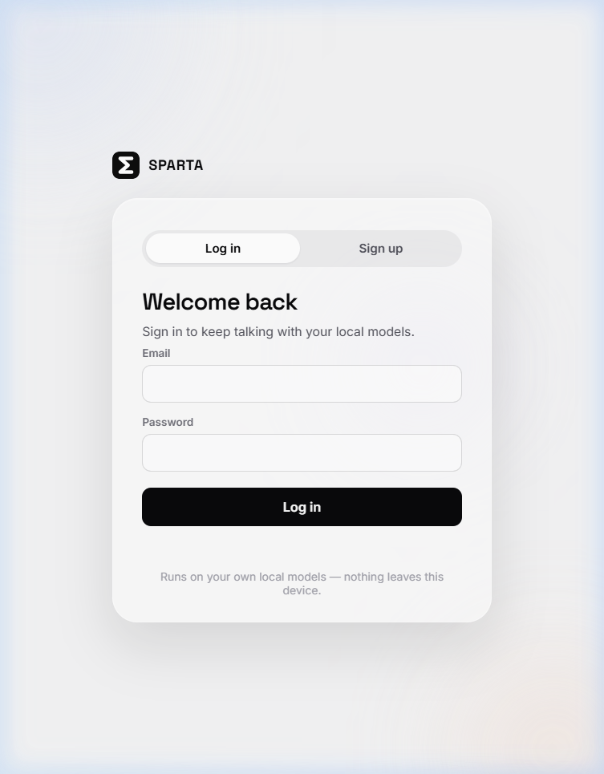
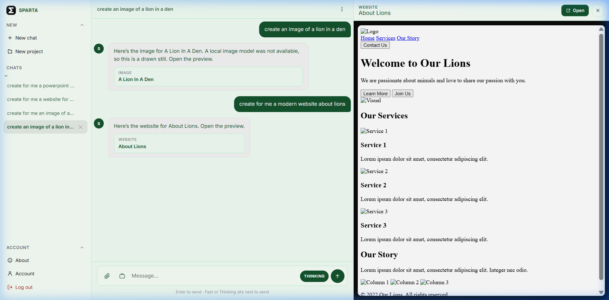
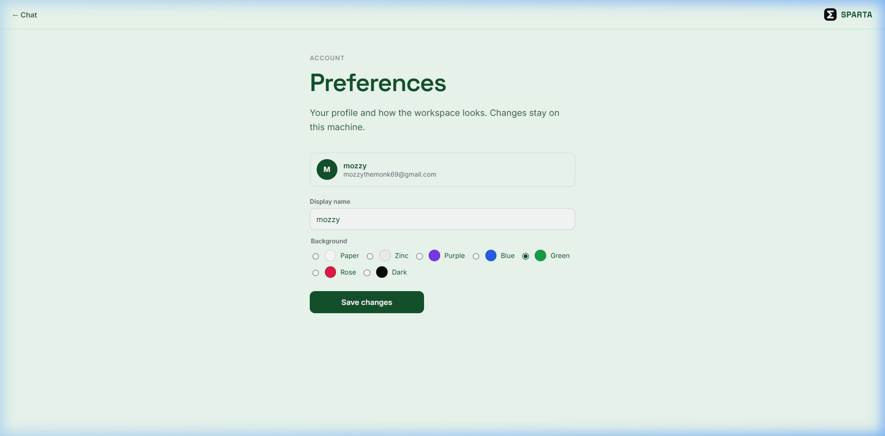

<div align="center">

# ⚡ Sparta AI — Local AI Chat App

**A private, self-contained AI studio running 100% on your local machine.**  
*Zero external API calls. No subscriptions. No cloud trackers. Pure PHP, SQLite, and local intelligence.*

[](https://www.php.net/)
[](https://www.sqlite.org/)
[](https://ollama.com/)
[](https://github.com/Mohammedismail-cyber/sparta-ai-chat-app)
[](LICENSE)

</div>

---

## 📸 Interface Preview

### 1. Welcome & Showcase
Split layout authentication screen featuring liquid-glass styling and live showcase panels.



---

### 2. Chat Workspace & Live Artifact Previews
Full chat experience with sidebar conversation history, projects, multi-modal attachments, and interactive side-by-side artifact previews (websites, code, images).



---

### 3. Account Preferences & Dynamic Themes
Personalized workspace customization with curated themes (*Paper, Zinc, Purple, Blue, Green, Rose, Dark*), avatar management, and display preferences.



---

## ✨ Features

- 🧠 **100% Local Intelligence** — Talks directly to models running on your hardware via [Ollama](https://ollama.com), LM Studio, or llama.cpp. Your data never leaves your computer.
- 💬 **Multi-Conversation Workspace** — Create separate chats, organize them into named projects, and review past history with instant local SQLite lookups.
- 🖼️ **Multi-Modal Vision & File Attachments** — Attach images, PDFs, notes, and documents. Images are encoded and delivered directly to vision-capable local models.
- 📸 **In-Browser Screenshot Capture** — Capture full screens, windows, or browser tabs directly using the web media capture API.
- 🛠️ **Live Artifact & Website Previews** — Generate websites, interactive HTML previews, mockups, and images that open right beside your conversation.
- 🎨 **Adaptive Liquid-Glass UI** — Designed with custom CSS glassmorphism, dynamic glowing ambient backgrounds, smooth transitions, and multi-theme customization.
- 🔐 **Robust Security** —
  - Bcrypt password hashing (`password_hash`).
  - Strict CSRF token validation on all mutating actions.
  - Brute-force rate-limiting and login lockout after 5 consecutive failures.
  - Protected uploaded files with `finfo` byte inspection and authenticated owner-only serving.
  - Zero SQL injection risk with 100% PDO prepared statements.
- 🚀 **Zero Server Overhead** — No heavy Node.js runtimes, Docker containers, or complex database servers required. Plain PHP + SQLite database with automatic migrations.

---

## 📁 Repository Structure

```plaintext
sparta-ai-chat-app/
├── index.php                 # Root entrypoint redirecting to /ai-chat-app/
├── php.ini                   # Local development PHP configuration
├── README.md                 # Project documentation & visual guide
├── docs/
│   └── screenshots/          # Application preview screenshots
│       ├── 01-login-screen.png
│       ├── 02-chat-workspace.png
│       └── 03-account-preferences.png
└── ai-chat-app/
    ├── index.php             # Session router (redirects to chat.php or login.php)
    ├── login.php             # Authentication interface
    ├── chat.php              # Primary chat workspace & preview layout
    ├── account.php           # User preferences & theme customization
    ├── about.php             # Product overview & details
    ├── manifest.json         # PWA installable manifest
    ├── api/                  # REST-like backend endpoints
    │   ├── login.php / register.php / logout.php
    │   ├── conversations.php # Chat management & project assignments
    │   ├── get_history.php   # Message thread loader
    │   ├── send_message.php  # Model invocation & streaming pipeline
    │   ├── models.php        # Model discovery and selection
    │   ├── upload.php        # File & screenshot intake handler
    │   └── file.php          # Secure authenticated attachment delivery
    ├── includes/             # Core application libraries
    │   ├── config.php        # Model runtime & environment settings
    │   ├── auth.php          # Session management & CSRF protection
    │   ├── db.php            # SQLite bootstrap & idempotent schema migrations
    │   ├── llm.php           # Local runtime connection & vision formatting
    │   └── uploads.php       # Attachment whitelist validation & storage
    ├── assets/               # Frontend styling and scripts
    │   ├── css/style.css     # Unified design system
    │   ├── js/               # Chat, authentication, and animation controllers
    │   └── img/              # Branding, icons, and favicons
    ├── data/                 # SQLite database & local model caches (auto-generated)
    └── uploads/              # Isolated user attachments (auto-generated)
```

---

## 🚀 Quick Start

### 1. Prerequisites

- **PHP 8.1+** with the following standard extensions:
  - `pdo_sqlite`
  - `curl`
  - `mbstring`
  - `fileinfo`
- **[Ollama](https://ollama.com)** (or another OpenAI-compatible local runtime such as LM Studio or llama.cpp).

### 2. Pull a Local Model

Start Ollama and pull any model of your choice:

```bash
# General chat & reasoning
ollama pull llama3.2

# Vision & image understanding (recommended for file/image attachments)
ollama pull llama3.2-vision
```

### 3. Clone & Run the App

```bash
# Clone the repository
git clone https://github.com/Mohammedismail-cyber/sparta-ai-chat-app.git
cd sparta-ai-chat-app

# Start PHP built-in web server
php -S localhost:8000
```

Open [http://localhost:8000](http://localhost:8000) in your browser.

### 4. Create an Account

Register with your name and email on the Sign Up tab. The SQLite database (`data/app.sqlite`) and all required tables are automatically created on your first visit.

---

## ⚙️ Configuration & Custom Runtimes

Settings are located in [`ai-chat-app/includes/config.php`](ai-chat-app/includes/config.php).

### Connecting to Other Local Runtimes

Sparta defaults to Ollama at `http://localhost:11434/api/chat`. If you use LM Studio or llama.cpp server with OpenAI compatibility:

```php
define('LLM_BASE_URL', 'http://127.0.0.1:1234');
define('LLM_ENDPOINT', 'http://127.0.0.1:1234/v1/chat/completions');
```

---

## 🛡️ Security & Architecture

- **Airgapped Privacy**: All inference requests are dispatched locally over `localhost`. No data is dispatched to cloud endpoints.
- **Access Isolation**: Direct HTTP access to the SQLite database (`/data`) and attachments (`/uploads`) is blocked via `.htaccess` / server configuration.
- **Attachment Whitelist**: Files are verified using byte-level MIME detection (`finfo`) against permitted formats (PNG, JPEG, WebP, GIF, PDF, Markdown, Plain Text, CSV, JSON) up to 20MB.

---

## 📄 License

This project is open source and available under the [MIT License](LICENSE).
